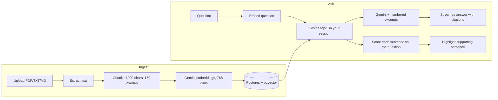

# DocuChat

Chat with your documents. Upload PDFs or text files, ask questions, and get streamed answers that **cite their sources and highlight the exact passage each answer relies on**.

Built with Next.js (App Router), the Vercel AI SDK, Gemini and Postgres + pgvector. Runs entirely on free tiers.

<!-- Add a screenshot or GIF here: docs/demo.gif -->

**Live demo:** _add your Vercel URL_

## How it works



1. **Ingest** — `POST /api/documents` extracts the text (`unpdf` for PDFs), splits it into overlapping chunks, embeds them with Gemini and stores everything in a single atomic SQL statement.
2. **Retrieve** — `POST /api/chat` embeds the question (plus the previous one, so follow-ups still work) and runs an exact cosine search restricted to the caller's own chunks.
3. **Generate** — the top-5 chunks go into the prompt as numbered excerpts; the model streams an answer and cites them as `[1]`, `[2]`. Citations become clickable chips, renumbered in reading order, and only the sources actually cited are listed.
4. **Highlight** — in parallel with generation, every sentence of the retrieved chunks is embedded and compared with the question. The best one or two are highlighted inside each source, so you can see _where_ the answer came from instead of reading a wall of text.

## Stack

| | |
|---|---|
| Framework | Next.js 16 (App Router, route handlers), React 19, TypeScript |
| AI | Vercel AI SDK v7, `@ai-sdk/google` — `gemini-3.1-flash-lite` (fallback `gemini-3.5-flash-lite`) + `gemini-embedding-001` |
| Database | Postgres + [pgvector](https://github.com/pgvector/pgvector) on Neon (`@neondatabase/serverless`) |
| UI | Tailwind CSS v4, `react-markdown`, IBM Plex + Source Serif 4 |
| Quality | Vitest, ESLint, GitHub Actions |

## Getting started

Requires Node 20.6+ (tested on 24).

```bash
npm install
cp .env.example .env.local   # then fill in the two values below
```

1. **Gemini key** — create one at [aistudio.google.com/apikey](https://aistudio.google.com/apikey). Use a project **without billing** attached to stay on the free tier (a project with prepay billing and $0 credit returns `429`).
2. **Database** — create a free project at [neon.tech](https://neon.tech) and paste its connection string as `DATABASE_URL`.

```bash
npm run check:gemini   # verifies the key, both chat models and the embedding model
npm run db:setup       # enables pgvector and creates the tables
npm run dev            # http://localhost:3000
```

Scripts: `npm test`, `npm run lint`, `npm run typecheck`, `npm run build`.

### About free-tier limits

Free quotas are small, differ per model and change often. For example, `gemini-3.6-flash` allowed only **20 requests per day** per project when tested, and older models such as `gemini-2.5-flash` have been retired (`404`). That is why the app has a fallback model (`GEMINI_FALLBACK_MODEL`) and why `check:gemini` reports each model separately. Check your real limits in [AI Studio](https://aistudio.google.com).

## Design decisions

- **Per-visitor isolation without accounts.** An anonymous `httpOnly` session cookie scopes every document and chunk, so visitors of a public demo never see each other's files.
- **Exact search instead of an ANN index.** Each session holds at most a few hundred chunks, so a sequential scan is fast. An HNSW index combined with a `WHERE session_id = …` filter can return _fewer_ than k rows because the filter runs after the index scan; exact search never has that problem. Switch to a partitioned or filtered ANN index if you ever need millions of chunks per tenant.
- **Highlights via embeddings, not keyword matching.** Comparing sentence embeddings with the question works across languages (a Spanish question about an English document still highlights the right sentence), where word overlap would not. The threshold was calibrated on real data: unrelated questions peak around 0.55 similarity, relevant ones land between 0.63 and 0.81, so nothing is highlighted below 0.58. Highlighting is best-effort: if it fails or times out, the answer is unaffected.
- **Automatic model fallback.** If the primary model is out of quota, overloaded or slow before producing any text, the next one answers instead. Nothing has reached the user at that point, so the switch is invisible; a model that fails _after_ streaming has started is not swapped, to avoid duplicating the answer. Only the last model retries; the others fail fast rather than waiting out a `Retry-After` of up to a minute.
- **Prompt-injection aware.** Retrieved text is fenced in `<excerpts>` and the system prompt tells the model to treat it as untrusted data. On the way out, Markdown images are disabled and links are not rendered, so an injected document cannot exfiltrate data through a URL.
- **Demo-safe limits** (see `src/lib/config.ts`): 5 documents per session, 4 MB and 150 chunks per document (Vercel Functions reject request bodies over 4.5 MB), 1000-character questions, documents auto-deleted after 24 h.
- **Honest failure states.** A quota error, provider overload or timeout each produce a specific message and a retry button; config errors are hidden from visitors in production. The agent's bubble appears the moment a question is sent, with a Stop button while it writes.
- **Atomic ingestion.** Document row and all its chunks are inserted in one CTE, so a failure never leaves a half-indexed document.

## Deploy

1. Push to GitHub and import the repo in [Vercel](https://vercel.com).
2. Add `GEMINI_API_KEY` and `DATABASE_URL` as environment variables.
3. Run `npm run db:setup` once against the production database.

## Roadmap

- [ ] Rate limiting per IP (Upstash Redis)
- [ ] Hybrid search (BM25 + vectors) and re-ranking
- [ ] OCR for scanned PDFs
- [ ] Persist chat history per session
- [ ] Open the original PDF at the cited page
